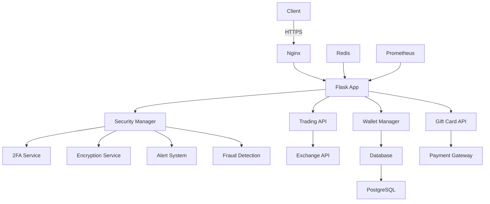

# BITOKI - Secure Cryptocurrency Trading Platform


**BITOKI** is a comprehensive, production-ready cryptocurrency trading platform with enterprise-grade security features, fraud protection, and a user-friendly interface.

## 🚀 Quick Start

### Local Development

```bash
# Clone the repository
git clone https://github.com/oluwafemidiakhoa/BITOKI.git
cd BITOKI

# Install dependencies
pip install -r requirements.txt

# Start local development server
./start_local.sh

# Access the application
open http://117.0.0.1:5000
```

### Production Deployment

```bash
# Build and start production containers
docker-compose -f docker-compose.prod.yml up --build

# Access the application
open http://localhost:8000
```

## 🔒 Security Features

### ✅ Two-Factor Authentication (2FA)
- **TOTP Support**: Time-based one-time passwords with QR code setup
- **Backup Codes**: Secure recovery options
- **Email Notifications**: Alerts for 2FA setup and usage
- **API Endpoints**: Full 2FA management via REST API

### ✅ Wallet Encryption
- **AES-256 Encryption**: Military-grade encryption for all wallets
- **PBKDF2 Key Derivation**: 100,000 iterations for secure password hashing
- **Individual Encryption**: Each currency wallet encrypted separately
- **Secure Salt Management**: Unique salts for each encryption operation

### ✅ Immutable Transaction History
- **Blockchain-like Chaining**: SHA-256 hashing for tamper-proof records
- **Cryptographic Verification**: Automatic integrity checking
- **Complete Audit Trail**: Full transaction history with cryptographic proofs
- **Fraud Detection**: Automatic pattern recognition

### ✅ Instant Alert System
- **Real-time Notifications**: Immediate alerts for security events
- **Multiple Channels**: Email, console, and API-based alerts
- **Severity Levels**: Low, medium, high, critical categorization
- **Alert Management**: Read/unread tracking and history

### ✅ Biometric Support
- **Face ID/Touch ID**: Framework for device biometric authentication
- **Secure Storage**: Encrypted biometric data handling
- **Fallback Mechanisms**: Alternative authentication methods

## 🛡️ Fraud Protection

### Gift Card Security
- **Velocity Checking**: Detect rapid successive transactions
- **Large Transaction Alerts**: Automatic verification requirements
- **Stock Monitoring**: Real-time availability tracking
- **Pattern Detection**: Machine learning-based fraud recognition

### Transaction Security
- **Rate Limiting**: Protection against brute force attacks
- **IP Analysis**: Anomaly detection based on geographic patterns
- **Session Management**: Secure cookie handling with HSTS
- **CSP Headers**: Content Security Policy for XSS protection

## 📦 Architecture



## 🎯 Key Components

### Security Manager
```python
from src.bitoki.security.security_manager import SecurityManager

security = SecurityManager()

# Setup 2FA
two_factor = security.setup_2fa("user_id", "totp")

# Verify 2FA
is_valid = security.verify_2fa_code("user_id", "123456")

# Encrypt wallet
encrypted_wallet = security.encrypt_wallet_balance(
    "user_id", "BTC", 0.5, "user_password"
)

# Add transaction
transaction = security.add_transaction({
    "user_id": "user_id",
    "type": "deposit",
    "amount": 1000,
    "currency": "USD"
})
```

### Email Service
```python
from src.bitoki.utils.email_service import EmailService

email = EmailService()

# Send login alert
email.send_login_alert(
    "user@example.com",
    "user_id",
    "192.168.1.1",
    "Chrome on Windows 10"
)

# Send 2FA setup email
email.send_2fa_setup_email(
    "user@example.com",
    "qr_code_url",
    ["ABC123", "DEF456", "GHI789"]
)
```

## 🌐 API Endpoints

### Security API

| Endpoint | Method | Description |
|----------|--------|-------------|
| `/api/security/setup-2fa` | POST | Setup two-factor authentication |
| `/api/security/verify-2fa` | POST | Verify 2FA code |
| `/api/security/alerts` | GET | Get security alerts |
| `/api/security/mark-alert-read` | POST | Mark alert as read |
| `/api/security/transaction-history` | GET | Get immutable transaction history |
| `/api/security/check-fraud` | POST | Check for fraud patterns |
| `/api/security/test-email` | POST | Test email sending |

### Trading API

| Endpoint | Method | Description |
|----------|--------|-------------|
| `/api/trade/buy` | POST | Buy cryptocurrency |
| `/api/trade/sell` | POST | Sell cryptocurrency |
| `/api/trade/swap` | POST | Swap cryptocurrencies |
| `/api/trade/price/<currency>` | GET | Get current price |
| `/api/trade/history` | GET | Get trade history |

### Wallet API

| Endpoint | Method | Description |
|----------|--------|-------------|
| `/api/wallet/balances` | GET | Get wallet balances |
| `/api/wallet/deposit-address/<currency>` | GET | Get deposit address |
| `/api/wallet/transactions` | GET | Get transaction history |

## 📊 Monitoring & Analytics

### Prometheus Metrics
- **Endpoint**: `/metrics`
- **Port**: 9090
- **Metrics**: Request rates, error rates, response times

### Grafana Dashboard
- **Endpoint**: `http://localhost:3000`
- **Credentials**: admin/admin
- **Features**: Real-time monitoring, alerting, historical data

## 🔧 Configuration

### Development Configuration
```yaml
# config/local_config.yaml
app:
  environment: "development"
  debug: true
  host: "117.0.0.1"
  port: 5000

security:
  two_factor:
    required_for_logins: false

email:
  use_console: true
```

### Production Configuration
```yaml
# config/production_config.yaml
app:
  environment: "production"
  debug: false
  host: "0.0.0.0"
  port: 8000

security:
  two_factor:
    required_for_logins: true
    required_for_transfers: true
```

## 🚢 Deployment

### Docker
```bash
# Build image
docker build -t bitoki/production .

# Run container
docker run -d -p 8000:8000 --name bitoki bitoki/production
```

### Docker Compose
```bash
# Start all services
docker-compose -f docker-compose.prod.yml up --build

# Stop services
docker-compose -f docker-compose.prod.yml down
```

### Kubernetes
```yaml
# deployment.yaml
apiVersion: apps/v1
kind: Deployment
metadata:
  name: bitoki
spec:
  replicas: 3
  selector:
    matchLabels:
      app: bitoki
  template:
    metadata:
      labels:
        app: bitoki
    spec:
      containers:
      - name: bitoki
        image: bitoki/production:latest
        ports:
        - containerPort: 8000
```

## 📚 Documentation

### Security Documentation
- [2FA Implementation Guide](docs/2fa_implementation.md)
- [Encryption Standards](docs/encryption_standards.md)
- [Fraud Detection Algorithms](docs/fraud_detection.md)

### API Documentation
- [REST API Reference](docs/api_reference.md)
- [WebSocket API](docs/websocket_api.md)
- [Authentication Guide](docs/authentication.md)

### Development Guides
- [Local Setup Guide](docs/local_setup.md)
- [Contribution Guidelines](docs/contributing.md)
- [Testing Strategy](docs/testing.md)

## 🤝 Contributing

1. **Fork the repository**
2. **Create a feature branch**: `git checkout -b feature/your-feature`
3. **Commit your changes**: `git commit -m 'Add some feature'`
4. **Push to the branch**: `git push origin feature/your-feature`
5. **Open a pull request**

## 📜 License

This project is licensed under the MIT License - see the [LICENSE](LICENSE) file for details.

## 📞 Support

For support, please contact:
- **Email**: support@bitoki.com
- **GitHub Issues**: https://github.com/oluwafemidiakhoa/BITOKI/issues
- **Documentation**: https://bitoki.com/docs

## 🎉 Features Roadmap

### Q1 2025
- [x] Core trading functionality
- [x] Security module implementation
- [x] 2FA authentication
- [x] Wallet encryption
- [x] Fraud detection

### Q2 2025
- [ ] Mobile application (iOS/Android)
- [ ] Advanced trading algorithms
- [ ] Margin trading support
- [ ] Social trading features

### Q3 2025
- [ ] Decentralized exchange integration
- [ ] NFT marketplace
- [ ] Staking rewards
- [ ] Cross-chain swaps

## 🔗 Related Projects

- [BITOKI Web](https://github.com/oluwafemidiakhoa/BITOKI-web) - Frontend application
- [BITOKI Mobile](https://github.com/oluwafemidiakhoa/BITOKI-mobile) - Mobile applications
- [BITOKI API](https://github.com/oluwafemidiakhoa/BITOKI-api) - API services

## 📈 Analytics

[](https://github.com/oluwafemidiakhoa/BITOKI/stargazers)
[](https://github.com/oluwafemidiakhoa/BITOKI/network)
[](https://github.com/oluwafemidiakhoa/BITOKI/issues)
[](LICENSE)

## 🎓 Learning Resources

- [Cryptocurrency Trading Guide](docs/trading_guide.md)
- [Security Best Practices](docs/security_best_practices.md)
- [Blockchain Fundamentals](docs/blockchain_fundamentals.md)

---

**BITOKI** - Secure. Fast. Reliable.

© 2025 BITOKI Technologies. All rights reserved.